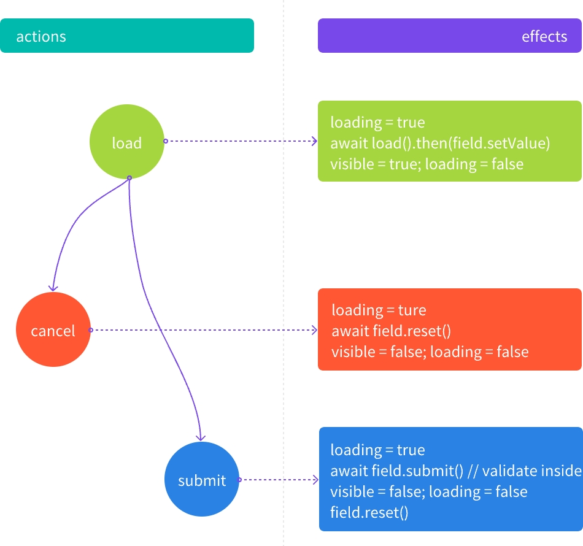

## PopActions - 弹窗动作

PopActions 是为了解决常见的 Popover/Popconfirm/Modal/Drawer 弹窗编辑子表单模板代码的问题

## 为什么不是 [FormDialog](https://antd.formilyjs.org/zh-CN/components/form-dialog#formdialog-1)/[FormDrawer](https://antd.formilyjs.org/zh-CN/components/form-drawer#formdrawer-1) ?

这两个都是方法调用, 不能用 json 描述出来所以 `FormDialog/FormDrawer` 适合用于更灵活的场景;
此外, `FormDialog/FormDrawer` 内部是使用了 [document.body.appendChild](https://github.com/alibaba/formily/blob/formily_next/packages/antd/src/form-drawer/index.tsx#L122) 凭空创建了一个新的 dom 节点来承载这个表单, 脱离了 root 节点, 所以需要用 [Portals](https://zh-hans.reactjs.org/docs/portals.html) 打补丁, 可能会遇到一些奇奇怪怪的问题, 加上我们的目的是减少模版代码的处理, 不需要编程式那么灵活;

因此对于常见的弹出表单处理逻辑, 尝试归纳为为三个固定的动作

```
- open    // 预加载? -> 打开弹窗
- cancel  // 取消 -> 关闭弹窗
- confirm // 确定 -> 关闭弹窗
```

全部转换成表单领域的术语, 在加上 `Promise` 包装, 可以这样来表示

```ts
interface Action<Record = any, Data = Record> {
  /** 加载初始值 **/
  load: (record: Record) => Promise<Data>;
  /** 重置表单, 关闭弹窗 **/
  reset: () => Promise<void>;
  /** 提交表单, 关闭弹窗 **/
  submit: (data: Data) => Promise<any>;
}
```

先来理解一下 formily 作者提到的 [标准化CRUD作用域变量规范](https://github.com/alibaba/formily/discussions/3207) 的概念, 这里是 [React 实现#RecordScope](https://react.formilyjs.org/zh-CN/api/components/record-scope), 这里是实际使用场景 [@formily/antd#ArrayBase.Item](https://github.com/alibaba/formily/blob/formily_next/packages/antd/src/array-base/index.tsx#L132)


几个例子:
1. ArrayTable 中, 弹窗编辑, 此时 `record` 是只当前行的数据, 同时有 `index` 表明当前下标, 以及 `records` 表明整个数组, 对应到 `ArrayBase.Item` 中的 `RecordScope`, 那么就可以通过 `useExpressScope` 来获取到 `$record`/`$index`/`$lookup` === `$records` 对应上面提到的三个概念
2. 标题栏中的新增弹窗, 因为是在 Table 之外, 此时 `$record`/`$index`/`$records` 不存在, 但这样就没意义了吗? 并不是. 比方说我们的数据结构这样

    ```ts
    const data = {
      info: { name: 'antd' },
      arr:[{ a: 1, b: 2, childOf: 'antd' }],
    }
    ```
假如我们要新增的一条记录, 其中 `childOf` 字段取值为 `arr` 兄弟字段, 那么除了
- 使用 `x-reactions#dependencies` 结合 `FormPath` 来解决
  ```ts pure
  data: {
    type: 'object',
    properties: {
      info: {
        type: 'object',
        //...
      },
      'actions.add': {
        title: '新增',
        name: 'actions.add',
        type: 'object',
        properties: {
          childOf: {
            type: 'string',
            'x-hidden': true,
            'x-reactions': {
              dependencies: ['.info'],
              fullfill: {
                schema: {
                  'x-value': '{{$deps[0].name}}'
                }
              }
            }
          }
        }
      },
      arr: {
        type: 'array',
        // ...
      }
    }
  },
  ```

- 也可以将 `data` 抽象作为 `record`, 使之能能够在 `ArrayField#ArrayItem` 的 `scope` 之外访问到;可以用这样的伪代码来理解
  ```tsx pure
  <RecordScope getRecord={() => data}>
    <ObjectField name="info"></ObjectField>
    <ObjectField name="actions.add">新增</ObjectField>
    <ArrayField name="arr">
      {data.arr.map((item, index) => {
        return <RecordScope getIndex={() => index} getRecord={() => item}>
          <StringField name="a"></StringField>
          <StringField name="b"></StringField>
          <StringField name="childOf"></StringField>
        </RecordScope>
      })}
  </ArrayField>
  </RecordScope>
  ```

## 推广开来 ~~格局打开~~
`$record` 概念理解开来, 也就是我们 `load` 中的 `record`, 作为消费 `$record` 的一个组件, 那么, 这个动作的泛用性就很广了

比方说: ~~先挣他一个小目标~~

- rowSelection - 列选择:

  ```tsx pure
  <RecordScope gerRecord={() => ({ selectedRows, selectedRowKeys })}>
    <Actions.Popconfirm>批量删除</Actions.Popconfirm>
    <Actions.Modal>批量导出</Actions.Modal>
  </RecordScope>
  ```
  就可以在 Actions 中消费任意 `RecordScope` 传递进来的值


## 重新聚焦 Focus on Actions

```ts
export type Actions<Record = any, Data = Record> = {
  load?: (
    scope: {
      $record?: Record,
      $index?: number,
      $lookup?: object,
      $records?: Record[],
      $query?: object,
      $list?: Record[],
      // ...others
    }
  ) => Promise<Data>;
  cancel?: (
    scope: {
      $record?: Record,
      $index?: number,
      $lookup?: object,
      $records?: Record[],
      $query?: object,
      $list?: Record[],
      // ...others
    }
  ) => Promise<any>;
  submit?: (
    data: Data,
    scope: {
      $record?: Record,
      $index?: number,
      $lookup?: object,
      $records?: Record[],
      $query?: object,
      $list?: Record[],
      // ...others
    }
  ) => Promise<any>;
};

```

为什么 `load` 可能会返回一个新的值? 很简单的例子: 根据列表项 id 查询详情

得益于 formily 中,  非 [VoidField](https://core.formilyjs.org/zh-CN/api/models/void-field), 都是可以单独执行 `reset/validate/submit` 动作的, 所以可以轻松的利用这个特性, 实现 `PopActions` 的子表单的 `重置/校验/提交` 动作



## API

默认为 Popconfirm

```tsx pure
export const PopActions = Modal as typeof Modal & {
  Popover: typeof Popover;
  Popconfirm: typeof Popconfirm;
  Modal: typeof Modal;
  Drawer: typeof Drawer;
};

export interface IButtonType {
  size?: React.ComponentProps<typeof Button>['size'];
  type?: React.ComponentProps<typeof Button>['type'];
}

export type CommonActions = {
  actions: Actions,
} & IButtonType;

```

### PopActions.Modal - 模态框弹出

```tsx pure
interface Modal = (
  props: React.ComponentProps<typeof AntdModal> & CommonActions
) => React.ReactNode;
```

### PopActions.Drawer - 抽屉弹出

```tsx pure
interface Drawer = (
  props: React.ComponentProps<typeof AntdDrawer> & CommonActions
) => React.ReactNode;
```

### PopActions.Popconfirm - 确认弹出

```tsx pure
interface Popconfirm = (
  props: React.ComponentProps<typeof AntdPopconfirm> & CommonActions
) => React.ReactNode;
```

### PopActions.Popover - 轻量弹窗

```tsx pure
interface Popover = (
  props: React.ComponentProps<typeof AntdPopover> & CommonActions
) => React.ReactNode;
```
