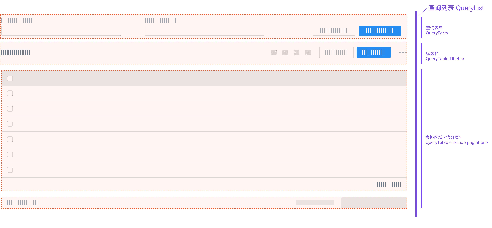

---
nav:
  title: 组件
---
## QueryList - 查询表格

QueryList 是为了解决常见的 CRUD 查询列表的样板代码的问题。

思路基本上就是照着官网指导 [formilyjs.org/查询列表](https://formilyjs.org/zh-CN/guide/scenes/query-list#%E6%9F%A5%E8%AF%A2%E5%88%97%E8%A1%A8), 在交互形式和配置项上则更多是参考
[ProComponents/ProTable](https://procomponents.ant.design/components/table);

可以理解为是 ProTable 的一个 formily 版本的实现。

## 布局结构


> 这个结构可以照这样来理解, 至于 Toolbar 为什么在 QueryTbale 上, 是因为它跟 QueryTable 联动更多一些

```tsx pure
<QueryList service={service}>
  <QueryForm />
  <QueryTable.Toolbar />
  <QueryTable />
</QueryList>

```

## 代码演示

<code src="./demos/QueryListDemo1.tsx"></code>

## API

## QueryList - 查詢列表

  ```json
  {
    scope: {
      $query: {},
      $list: []
    }
  }
  ```

### QueryList#service - 查詢服務

主要请求函数, 返回数据列表与总数, 入参包括查询表单, 分页、筛选、排序

入参与 [AntD#Table/onChange](https://ant.design/components/table-cn/#API) 保持一致, 追加了 `params` 即查询表单的参数


```ts
type Service = (data:
{
  /** 查询表单参数 **/
  params: {}
  /** 分页参数, 参考 AntD **/
  pagination: {
    current: number,
    pageSize: number
  },
  /** 过滤参数, 参考 AntD **/
  filters: [],
  /** 排序参数, 参考 AntD **/
  sorter: {},
  /** 额外信息, 参考 AntD **/
  extra: {
    action: 'paginate' | 'sort' | 'filter',
    currentDataSouce: Record[]
  }
}) => Promise<{ list: Record[], total: number }>
```

### QueryList#props - 其他配置项

```ts
  /** 首次自动刷新, 不为 false 即默认开启 */
  autoload?: boolean;
  /** filter 是否是远程处理 */
  filterRemote?: boolean;
  /** sort 是否是远程处理 */
  sortRemote?: boolean;
  /** size 大小 */
  size: 'default' | 'middle' | 'small';
  /** 是否将查询参数同步到url上 */
  syncUrl?: boolean;
  /** 分页大小, 默认 10 */
  pageSize?: number;
```

## QueryForm - 查詢條件表單

## QueryTable - 查詢表格
> ArrayBase.mixin(QueryTable)

### QueryTable.Titlebar - 查詢表格標題欄

### QueryTable.Selection - 表格多選容器
  ```json
  {
    scope: {
      $record: {
        selectedRows: [],
        selectedRowKeys: [],
      }
    }
  }
  ```
### QueryTable.Column - 常規表格列

### QueryTable.Operations - 操作列

### QueryTable.Expandable - 嵌套子表格
in properties
